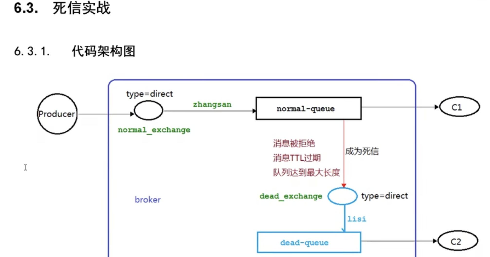

### 参考

https://www.bilibili.com/video/BV1cb4y1o7zz


# 安装 RabbitMq

```shell
docker run -it --rm --name rabbitmq -p 5672:5672 -p 15672:15672 rabbitmq:3.10-management
```

Rabbitmq 服务默认端口 5672, 网页端口 15672

默认用户名和密码都是 guest

http://localhost:15672/


rabbitmq 服务启动

```shell
systemctl start rabbitmq-server
```


## rabbitmqctl 

列出当前所有用户

```
rabbitmqctl list_users
```

增加一个用户

```
rabbitmqctl add_user admin 123
```

设置用户角色

```
rabbitmqctl set_user_tags admin administrator
```

设置用户权限

```bash
语法：rabbitmqctl [--node <node>] [--longnames] [--quiet] set_permissions [--vhost <vhost>] <username> <conf> <write> <read>

rabbitmqctl set_permissions --vhost "/" admin ".*" ".*" ".*"
```


## 生产者

```java
channel.queueDeclare(QUEUE_NAME, false, false, false, null);
```

第一个参数：队列名称

第二个参数：是否持久化

第三个参数：该队列是否只供一个消费者消费

第四个参数：是否自动删除，最后一个消费者断开连接时，该队列是否自动删除

第五个参数：其他参数


```java
channel.basicPublish("", QUEUE_NAME, null, message.getBytes());
```

第一个参数： 交换机

第二个参数：路由Key

第三个参数：其他参数

第四个参数：消息内容


```java
package top.waterlaw.utils;

import com.rabbitmq.client.Channel;
import com.rabbitmq.client.Connection;
import com.rabbitmq.client.ConnectionFactory;

import java.io.IOException;
import java.util.concurrent.TimeoutException;

public class RabbitMqUtil {

    public static Channel getChannel() throws IOException, TimeoutException {
        ConnectionFactory factory = new ConnectionFactory();
        factory.setHost("localhost");
        factory.setUsername("admin");
        factory.setPassword("123");

        Connection connection = factory.newConnection();
        return connection.createChannel();
    }
}
```


```java
package top.waterlaw;

import com.rabbitmq.client.Channel;
import top.waterlaw.utils.RabbitMqUtil;

import java.io.IOException;
import java.util.Scanner;
import java.util.concurrent.TimeoutException;

public class Task01 {
    public static final String QUEUE_NAME = "test";

    public static void main(String[] args) throws IOException, TimeoutException {

        Channel channel = RabbitMqUtil.getChannel();
        channel.queueDeclare(QUEUE_NAME, false, false, false, null);

        System.out.println("生产者启动");
        Scanner scanner = new Scanner(System.in);
        while (scanner.hasNext()) {
            String message = scanner.next();
            channel.basicPublish("", QUEUE_NAME, null, message.getBytes());
        }
    }
}
```


### 消费者

```java
channel.basicConsume(QUEUE_NAME, true, deliverCallback, cancelCallback);
```

第一个参数：队列名称

第二个参数：消息消费后是否自动 ACK

第三个参数：消息消费时会自动调用的回调函数

第四个参数：消息取消消费时调用的回调函数

```java
package top.waterlaw;

import com.rabbitmq.client.CancelCallback;
import com.rabbitmq.client.Channel;
import com.rabbitmq.client.DeliverCallback;
import top.waterlaw.utils.RabbitMqUtil;

import java.io.IOException;
import java.util.concurrent.TimeoutException;

public class Work01 {
    public static final String QUEUE_NAME = "test";

    public static void main(String[] args) throws IOException, TimeoutException {
        Channel channel = RabbitMqUtil.getChannel();
        // 接收消息时回调
        DeliverCallback deliverCallback = (consumerTag, message) -> {
            System.out.println("接收到消息：" + new String(message.getBody()));
            // 手动 ACK, 第二个参数表示不批量 ACK 此 channel 上的消息
            channel.basicAck(message.getEnvelope().getDeliveryTag(), false);
        };
        // 消息取消消费的回调
        CancelCallback cancelCallback = (consumerTag) -> {
            System.out.println(consumerTag+"消息取消消费");
        };
        System.out.println("C2队列等待消费");
        // 手动 ACK
        boolean autoAck = false;
        channel.basicConsume(QUEUE_NAME, autoAck, deliverCallback, cancelCallback);
    }
}
```


### 消息应答

消费者处理完消息后，告诉 MQ 消费完毕，发送确认 ACK， 然后 MQ 从队列中删除该消息

#### 手动应答

Channel.basicAck:  用于肯定确认

Channel.basicNack:  用于否定确认，比 Channel.basicReject 多一个参数表示可以进行批量操作此信道上的消息

Channel.basicReject:  用于否定确认, 比 Channel.basicNack 少一个参数，表示不处理该消息了，可以直接丢弃了

#### 消息自动重新入队

如果消费者由于某种原因失去连接（其通道已关闭，连接已关闭或者 Tcp 连接丢失），导致消息未发送 ACK 确认，

RabbitMq 了解到 消息未完全处理，并将其重新入队。如果此时有其他消费者可以处理，则将消息分发给该消费者处理。

### 消息持久化

#### 队列持久化

在生产者端开启 

```java
        // 开启队列持久化
        boolean durable = true;
        channel.queueDeclare(QUEUE_NAME, durable, false, false, null);
```

队列持久化，原有的队列必须删除，才能启用持久化

#### 消息持久化

```java
// 消息持久化 MessageProperties.PERSISTENT_TEXT_PLAIN
            channel.basicPublish("", QUEUE_NAME, MessageProperties.PERSISTENT_TEXT_PLAIN, message.getBytes());
```


#### 不公平分发

RabbitMq 默认使用轮询分发消息，这样可能因某个消费者执行长任务而导致消息消费缓慢，降低效率，不公平分发可以按照消费能力分发消息

具体方法是在消费端指定 预取值，预取值表示该消费者在每次分发时保证目前消费的消息最大总数目，消费慢的线程会少分配到任务

```java
        // 不公平分发  预取值
        int prefetchCount = 1;
        channel.basicQos(prefetchCount);
```

### 发布确认

#### 单个或者批量确认

```java
        // 开启发布确认
        channel.confirmSelect();
// basicPublish 后调用此方法
boolean flag = channel.waitForConfirms();
```


#### 异步批量确认

```java
        // 开启发布确认
        channel.confirmSelect();
        ConfirmCallback ackCallBack = (id, mutiFlg) -> {
            // 消息确认成功回调函数
        };
        ConfirmCallback nAckCallBack = (id, mutiFlg) -> {
            // 消息确认失败回调函数
        };
        // 准备监听器
        channel.addConfirmListener(ackCallBack, nAckCallBack);
```


#### 处理未确认的消息

```java
       // 存储所有消息-线程安全的数据结构
        ConcurrentSkipListMap<Long, String> outConfirmMap = new ConcurrentSkipListMap<>();
        ConfirmCallback ackCallBack = (messageTag, mutiFlg) -> {
            // 消息确认成功回调函数
            System.out.println("确认的消息" + messageTag);
            // 删除已经确认的消息
            if(mutiFlg) {
                ConcurrentNavigableMap confirmedMap = outConfirmMap.headMap(messageTag);
                confirmedMap.clear();
            } else {
                outConfirmMap.remove(messageTag);
            }
        };
        
                  // 消息持久化 MessageProperties.PERSISTENT_TEXT_PLAIN
            channel.basicPublish("", QUEUE_NAME, MessageProperties.PERSISTENT_TEXT_PLAIN, message.getBytes());
            outConfirmMap.put(channel.getNextPublishSeqNo(), message);
```

## 交换机

消息一般先发到交换机，然后由交换机分配到不同的队列

交换机类型有，direct(路由), topic, headers, fanout(广播) 四种类型


### 临时队列

　

```java
channel.queueDeclare().getQueue();
```


### fanout

发布订阅，广播到所有队列

消费者

```java
package top.waterlaw.fanout;

import com.rabbitmq.client.Channel;
import com.rabbitmq.client.DeliverCallback;
import top.waterlaw.utils.RabbitMqUtil;

import java.io.IOException;
import java.util.concurrent.TimeoutException;

public class Consumer01 {

    // 交换机名称
    public static final String LOGS_EXCHANGE_NAME = "logs";

    public static void main(String[] args) throws IOException, TimeoutException {
        Channel channel = RabbitMqUtil.getChannel();
        // 声明一个交换机
        channel.exchangeDeclare(LOGS_EXCHANGE_NAME, "fanout");
        // 声明一个队列
        String queueName = channel.queueDeclare().getQueue();
        // 绑定队列和交换机
        channel.queueBind(queueName, LOGS_EXCHANGE_NAME, "");
        DeliverCallback deliverCallback = (consumerTag, message) -> {
            System.out.println("1收到消息：" + new String(message.getBody(), "UTF-8"));
        };
        channel.basicConsume(queueName, true, deliverCallback, consumerTag -> {});
    }
}
```


生产者

```java
package top.waterlaw.fanout;

import com.rabbitmq.client.Channel;
import top.waterlaw.utils.RabbitMqUtil;

import java.io.IOException;
import java.nio.charset.StandardCharsets;
import java.util.Scanner;
import java.util.concurrent.TimeoutException;

public class EmitLog {

    // 交换机名称
    public static final String LOGS_EXCHANGE_NAME = "logs";

    public static void main(String[] args) throws IOException, TimeoutException {
        Channel channel = RabbitMqUtil.getChannel();
        // 声明一个交换机
        channel.exchangeDeclare(LOGS_EXCHANGE_NAME, "fanout");
        Scanner scanner = new Scanner(System.in);
        while (scanner.hasNext()) {
            String message = scanner.next();
            System.out.println("生产者发出消息：" + message);
            channel.basicPublish(LOGS_EXCHANGE_NAME, "", null, message.getBytes(StandardCharsets.UTF_8));
        }
    }
}
```

### direct 

根据路由 key 直接路由到队列


```java
package top.waterlaw.direct;

import com.rabbitmq.client.BuiltinExchangeType;
import com.rabbitmq.client.Channel;
import com.rabbitmq.client.DeliverCallback;
import top.waterlaw.utils.RabbitMqUtil;

import java.io.IOException;
import java.util.concurrent.TimeoutException;

public class Consumer01 {

    // 交换机名称
    public static final String EXCHANGE_NAME = "direct_logs";

    public static void main(String[] args) throws IOException, TimeoutException {
        Channel channel = RabbitMqUtil.getChannel();
        // 声明一个交换机
        channel.exchangeDeclare(EXCHANGE_NAME, BuiltinExchangeType.DIRECT);
        // 声明一个队列
        channel.queueDeclare("console", false, false, false, null);
        // 绑定队列和交换机 路由
        channel.queueBind("console", EXCHANGE_NAME, "info");
        channel.queueBind("console", EXCHANGE_NAME, "warning");
        DeliverCallback deliverCallback = (consumerTag, message) -> {
            System.out.println("1收到消息：" + new String(message.getBody(), "UTF-8"));
        };
        channel.basicConsume("console", true, deliverCallback, consumerTag -> {});
    }
}

```


```java
package top.waterlaw.direct;

import com.rabbitmq.client.BuiltinExchangeType;
import com.rabbitmq.client.Channel;
import com.rabbitmq.client.DeliverCallback;
import top.waterlaw.utils.RabbitMqUtil;

import java.io.IOException;
import java.util.concurrent.TimeoutException;

public class Consumer02 {

    // 交换机名称
    public static final String EXCHANGE_NAME = "direct_logs";

    public static void main(String[] args) throws IOException, TimeoutException {
        Channel channel = RabbitMqUtil.getChannel();
        // 声明一个交换机
        channel.exchangeDeclare(EXCHANGE_NAME, BuiltinExchangeType.DIRECT);
        // 声明一个队列
        channel.queueDeclare("disk", false, false, false, null);
        // 绑定队列和交换机 路由
        channel.queueBind("disk", EXCHANGE_NAME, "error");
        DeliverCallback deliverCallback = (consumerTag, message) -> {
            System.out.println("2收到消息：" + new String(message.getBody(), "UTF-8"));
        };
        channel.basicConsume("disk", true, deliverCallback, consumerTag -> {});
    }
}

```


```java
package top.waterlaw.direct;

import com.rabbitmq.client.BuiltinExchangeType;
import com.rabbitmq.client.Channel;
import top.waterlaw.utils.RabbitMqUtil;

import java.io.IOException;
import java.nio.charset.StandardCharsets;
import java.util.Scanner;
import java.util.concurrent.TimeoutException;

public class EmitLog {

    // 交换机名称
    public static final String EXCHANGE_NAME = "direct_logs";

    public static void main(String[] args) throws IOException, TimeoutException {
        Channel channel = RabbitMqUtil.getChannel();
        // 声明一个交换机
        channel.exchangeDeclare(EXCHANGE_NAME, BuiltinExchangeType.DIRECT);
        Scanner scanner = new Scanner(System.in);
        while (scanner.hasNext()) {
            String message = scanner.next();
            System.out.println("生产者发出消息：" + message);
            channel.basicPublish(EXCHANGE_NAME, "error", null, message.getBytes(StandardCharsets.UTF_8));
        }
    }
}

```


### topic

topic 的 routing_key 必须以点号隔开，最长 255 字节，

```txt
* 号代表一个单词
# 号代表多个单词
```


当队列绑定键是 # 号时， 为 fanout 模式；

当队列绑定键没有 * 和 # 时， 为 direct 模式；

```java
package top.waterlaw.topic;

import com.rabbitmq.client.BuiltinExchangeType;
import com.rabbitmq.client.Channel;
import com.rabbitmq.client.DeliverCallback;
import top.waterlaw.utils.RabbitMqUtil;

import java.io.IOException;
import java.util.concurrent.TimeoutException;

public class Consumer02 {

    // 交换机名称
    public static final String EXCHANGE_NAME = "topic_logs";

    public static void main(String[] args) throws IOException, TimeoutException {
        Channel channel = RabbitMqUtil.getChannel();
        // 声明一个交换机
        channel.exchangeDeclare(EXCHANGE_NAME, BuiltinExchangeType.TOPIC);
        // 声明一个队列
        channel.queueDeclare("Q2", false, false, false, null);
        // 绑定队列和交换机 路由
        channel.queueBind("Q2", EXCHANGE_NAME, "*.*.rabbit");
        channel.queueBind("Q2", EXCHANGE_NAME, "lazy.#");
        DeliverCallback deliverCallback = (consumerTag, message) -> {
            System.out.println("2收到消息：" + new String(message.getBody(), "UTF-8"));
        };
        channel.basicConsume("Q2", true, deliverCallback, consumerTag -> {});
    }
}

```


消费者 1 类似 消费者 2 代码， 只是 queueName 为 Q1 且绑定的路由不一样


```java
package top.waterlaw.topic;

import com.rabbitmq.client.BuiltinExchangeType;
import com.rabbitmq.client.Channel;
import top.waterlaw.utils.RabbitMqUtil;

import java.io.IOException;
import java.nio.charset.StandardCharsets;
import java.util.Scanner;
import java.util.concurrent.TimeoutException;

public class EmitLog {

    // 交换机名称
    public static final String EXCHANGE_NAME = "topic_logs";

    public static void main(String[] args) throws IOException, TimeoutException {
        Channel channel = RabbitMqUtil.getChannel();
        // 声明一个交换机
        channel.exchangeDeclare(EXCHANGE_NAME, BuiltinExchangeType.TOPIC);
        Scanner scanner = new Scanner(System.in);
        while (scanner.hasNext()) {
            String message = scanner.next();
            System.out.println("生产者发出消息：" + message);
            channel.basicPublish(EXCHANGE_NAME, "a.orange.b", null, 
                                 message.getBytes(StandardCharsets.UTF_8));
        }
    }
}

```


## 死信队列




消息 TTL 过期

```java
//        AMQP.BasicProperties properties = new AMQP.BasicProperties()
//                .builder()
//                .expiration("10000")
//                .build();
```

队列达到最大长度

```java
propMap.put("x-max-length", 6);
```

消息被拒绝

```java
        DeliverCallback deliverCallback = (consumerTag, message) -> {
            String msg = new String(message.getBody(), "UTF-8");
            if(msg.equals("info5")) {
                channel.basicReject(message.getEnvelope().getDeliveryTag(), false);
            } else {
                channel.basicAck(message.getEnvelope().getDeliveryTag(), false);
            }
            System.out.println(msg);
        };
        // 手动 ACK
        channel.basicConsume(NORMAL_QUEUE, false, deliverCallback, consumerTag -> {
        });
        
```

消费者 C1

```java
package top.waterlaw.deadqueue;

import com.rabbitmq.client.BuiltinExchangeType;
import com.rabbitmq.client.Channel;
import com.rabbitmq.client.DeliverCallback;
import top.waterlaw.utils.RabbitMqUtil;

import java.io.IOException;
import java.util.HashMap;
import java.util.Map;
import java.util.concurrent.TimeoutException;

public class Consumer01 {
    // 普通交换机名称
    public static final String NORMAL_EXCHANGE_NAME = "normal_exchange";
    // 死信交换机名称
    public static final String DEAD_EXCHANGE_NAME = "dead_exchange";
    // 普通队列名称
    public static final String NORMAL_QUEUE = "normal_queue";
    // 死信名称
    public static final String DEAD_QUEUE = "dead_queue";

    public static void main(String[] args) throws IOException, TimeoutException {
        Channel channel = RabbitMqUtil.getChannel();
        channel.exchangeDeclare(NORMAL_EXCHANGE_NAME, BuiltinExchangeType.DIRECT);
        // 死信交换机
        channel.exchangeDeclare(DEAD_EXCHANGE_NAME, BuiltinExchangeType.DIRECT);
        // 声明普通队列
        // 过期时间
        Map<String, Object> propMap = new HashMap<>();
        // 设置死信交换机
        propMap.put("x-dead-letter-exchange", DEAD_EXCHANGE_NAME);
        // 设置死信routing-key
        propMap.put("x-dead-letter-routing-key", "lisi");
        // 设置正常队列的最大长度
//        propMap.put("x-max-length", 6);
        channel.queueDeclare(NORMAL_QUEUE, false, false, false, propMap);
        channel.queueDeclare(DEAD_QUEUE, false, false, false, null);

        // 绑定交换机和队列
        channel.queueBind(NORMAL_QUEUE, NORMAL_EXCHANGE_NAME, "zhangsan");
        channel.queueBind(DEAD_QUEUE, DEAD_EXCHANGE_NAME, "lisi");

        DeliverCallback deliverCallback = (consumerTag, message) -> {
            String msg = new String(message.getBody(), "UTF-8");
            if(msg.equals("info5")) {
                channel.basicReject(message.getEnvelope().getDeliveryTag(), false);
            } else {
                channel.basicAck(message.getEnvelope().getDeliveryTag(), false);
            }
            System.out.println(msg);
        };

        channel.basicConsume(NORMAL_QUEUE, false, deliverCallback, consumerTag -> {
        });

    }

}
```


C1 需要创建交换机1，死信交换机，普通队列和死信队列，并将死信交换机关联到普通队列


```java
package top.waterlaw.deadqueue;

import com.rabbitmq.client.AMQP;
import com.rabbitmq.client.Channel;
import top.waterlaw.utils.RabbitMqUtil;

import java.io.IOException;
import java.util.concurrent.TimeoutException;

public class Product01 {
    // 普通交换机名称
    public static final String NORMAL_EXCHANGE_NAME = "normal_exchange";

    public static void main(String[] args) throws IOException, TimeoutException {
        Channel channel = RabbitMqUtil.getChannel();
//        AMQP.BasicProperties properties = new AMQP.BasicProperties()
//                .builder()
//                .expiration("10000")
//                .build();
        for (int i = 0; i < 10; i++) {
            String message = "info" + i;
            channel.basicPublish(NORMAL_EXCHANGE_NAME, "zhangsan", null, message.getBytes());
        }
    }
}
```


死信消费者和普通队列消费者一样

```java
package top.waterlaw.deadqueue;

import com.rabbitmq.client.Channel;
import com.rabbitmq.client.DeliverCallback;
import top.waterlaw.utils.RabbitMqUtil;

import java.io.IOException;
import java.util.concurrent.TimeoutException;

public class ConSumer02 {

    // 死信名称
    public static final String DEAD_QUEUE = "dead_queue";

    public static void main(String[] args) throws IOException, TimeoutException {
        Channel channel = RabbitMqUtil.getChannel();

        DeliverCallback deliverCallback = (consumerTag, message) -> {
            System.out.println(new String(message.getBody(), "UTF-8"));
        };
        channel.basicConsume(DEAD_QUEUE, true, deliverCallback, consumerTag -> {
        });
    }
}
```


## 延迟队列

延迟队列内部时有序的，延迟队列是 TTL 过期的死信队列，适合在某个时间点之前或之后完成某一项任务。


### 集成 springboot


pom.xml

```xml
<?xml version="1.0" encoding="UTF-8"?>
<project xmlns="http://maven.apache.org/POM/4.0.0"
         xmlns:xsi="http://www.w3.org/2001/XMLSchema-instance"
         xsi:schemaLocation="http://maven.apache.org/POM/4.0.0 http://maven.apache.org/xsd/maven-4.0.0.xsd">
    <parent>
        <groupId>org.springframework.boot</groupId>
        <artifactId>spring-boot-starter-parent</artifactId>
        <version>2.4.5</version>
        <relativePath/>
    </parent>
    <modelVersion>4.0.0</modelVersion>

    <groupId>com.waterlaw</groupId>
    <artifactId>springboot-rabbitmq</artifactId>
    <version>0.0.1-SNAPSHOT</version>

    <properties>
        <maven.compiler.source>8</maven.compiler.source>
        <maven.compiler.target>8</maven.compiler.target>
    </properties>

    <dependencies>
        <dependency>
            <groupId>org.springframework.boot</groupId>
            <artifactId>spring-boot-starter-amqp</artifactId>
        </dependency>
        <dependency>
            <groupId>org.springframework.boot</groupId>
            <artifactId>spring-boot-starter-web</artifactId>
        </dependency>
        <dependency>
            <groupId>org.springframework.boot</groupId>
            <artifactId>spring-boot-starter-test</artifactId>
        </dependency>
        <dependency>
            <groupId>com.alibaba</groupId>
            <artifactId>fastjson</artifactId>
            <version>1.2.47</version>
        </dependency>
        <dependency>
            <groupId>org.projectlombok</groupId>
            <artifactId>lombok</artifactId>
        </dependency>
        <dependency>
            <groupId>io.springfox</groupId>
            <artifactId>springfox-swagger2</artifactId>
            <version>2.9.2</version>
        </dependency>
        <dependency>
            <groupId>io.springfox</groupId>
            <artifactId>springfox-swagger-ui</artifactId>
            <version>2.9.2</version>
        </dependency>
    </dependencies>

    <build>
        <plugins>
            <plugin>
                <groupId>org.springframework.boot</groupId>
                <artifactId>spring-boot-maven-plugin</artifactId>
            </plugin>
        </plugins>
    </build>

</project>
```


application.properties

```properties
spring.rabbitmq.host=localhost
spring.rabbitmq.port=5672
spring.rabbitmq.username=admin
spring.rabbitmq.password=123
```


绑定关系

```java
package com.waterlaw.config;


import org.springframework.amqp.core.*;
import org.springframework.beans.factory.annotation.Qualifier;
import org.springframework.context.annotation.Bean;
import org.springframework.context.annotation.Configuration;

import java.util.HashMap;
import java.util.Map;

@Configuration
public class TtlQueueConfig {


    // 普通交换机
    public static final String NORMAL_EXCHANGE = "X";
    // 死信交换机
    public static final String DEAD_LETTER_EXCHANGE = "Y";


    // 普通队列
    public static final String NORMAL_QUEUEA = "QA";
    // 普通队列
    public static final String NORMAL_QUEUEB = "QB";
    // 普通队列
    public static final String NORMAL_QUEUEC = "QC";
    // 死信队列
    public static final String DEAD_LETTER_QUEUE = "QD";

    // 声明exchange
    @Bean("xExchange")
    public DirectExchange xExchange() {
        return new DirectExchange(NORMAL_EXCHANGE);
    }

    @Bean("yExchange")
    public DirectExchange yExchange() {
        return new DirectExchange(DEAD_LETTER_EXCHANGE);
    }

    @Bean("queueA")
    public Queue queueA() {
        // 设置死信交换机、设置死信队列
        Map<String, Object> argumentMap = new HashMap<>(3);
        argumentMap.put("x-dead-letter-exchange", DEAD_LETTER_EXCHANGE);
        argumentMap.put("x-dead-letter-routing-key", "YD");
        // 设置 ttl
        argumentMap.put("x-message-ttl", 10 * 1000);
        return QueueBuilder.durable(NORMAL_QUEUEA).withArguments(argumentMap).build();
    }

    @Bean("queueB")
    public Queue queueB() {
        // 设置死信交换机、设置死信队列
        Map<String, Object> argumentMap = new HashMap<>(3);
        argumentMap.put("x-dead-letter-exchange", DEAD_LETTER_EXCHANGE);
        argumentMap.put("x-dead-letter-routing-key", "YD");
        // 设置 ttl
        argumentMap.put("x-message-ttl", 40 * 1000);
        return QueueBuilder.durable(NORMAL_QUEUEB).withArguments(argumentMap).build();
    }

    @Bean("queueC")
    public Queue queueC() {
        // 设置死信交换机、设置死信队列
        Map<String, Object> argumentMap = new HashMap<>(2);
        argumentMap.put("x-dead-letter-exchange", DEAD_LETTER_EXCHANGE);
        argumentMap.put("x-dead-letter-routing-key", "YD");
        return QueueBuilder.durable(NORMAL_QUEUEC).withArguments(argumentMap).build();
    }

    @Bean("queueD")
    public Queue queueD() {
        // 设置死信交换机、设置死信队列
        return QueueBuilder.durable(DEAD_LETTER_QUEUE).build();
    }

    // 绑定 交换机和队列
    @Bean
    public Binding queueABindingX(@Qualifier("queueA") Queue queueA, 
                                  @Qualifier("xExchange") DirectExchange xExchange) {
        return BindingBuilder.bind(queueA).to(xExchange).with("XA");
    }

    @Bean
    public Binding queueBBindingX(@Qualifier("queueB") Queue queueB, 
                                  @Qualifier("xExchange") DirectExchange xExchange) {
        return BindingBuilder.bind(queueB).to(xExchange).with("XB");
    }

    @Bean
    public Binding queueCBindingX(@Qualifier("queueC") Queue queueC, 
                                  @Qualifier("xExchange") DirectExchange xExchange) {
        return BindingBuilder.bind(queueC).to(xExchange).with("XC");
    }

    @Bean
    public Binding queueDBindingX(@Qualifier("queueD") Queue queueD, 
                                  @Qualifier("yExchange") DirectExchange yExchange) {
        return BindingBuilder.bind(queueD).to(yExchange).with("YD");
    }
}
```


生产者

```java
package com.waterlaw.controller;

import lombok.extern.slf4j.Slf4j;
import org.springframework.amqp.rabbit.core.RabbitTemplate;
import org.springframework.beans.factory.annotation.Autowired;
import org.springframework.web.bind.annotation.GetMapping;
import org.springframework.web.bind.annotation.PathVariable;
import org.springframework.web.bind.annotation.RequestMapping;
import org.springframework.web.bind.annotation.RestController;

import java.util.Date;


@Slf4j
@RestController
@RequestMapping("/ttl")
public class SendMsgController {

    @Autowired
    private RabbitTemplate rabbitTemplate;

    @GetMapping("/sendMsg/{message}")
    public void testSendMsg(@PathVariable String message) {
        log.info("当前时间：{}, 发送一条信息：{}", new Date().toString(), message);
        // 交换机 X， 路由 XA
        rabbitTemplate.convertAndSend("X", "XA", "消息来自于ttl=10s的队列:" + message);
        rabbitTemplate.convertAndSend("X", "XB", "消息来自于ttl=40s的队列:" + message);
    }

    @GetMapping("/expiredMsg/{message}/{ttlTime}")
    public void testSExpiredMsg(@PathVariable String message, @PathVariable String ttlTime) {
        log.info("当前时间：{}, 发送一条TTL={}的信息{}到QC队列", new Date().toString(), ttlTime, message);
        rabbitTemplate.convertAndSend("X", "XC", message, message1 -> {
            // 设置延迟时长
            message1.getMessageProperties().setExpiration(ttlTime);
            return message1;
        });
    }
}
```


消费者

```java
package com.waterlaw.consumer;


import com.rabbitmq.client.Channel;
import lombok.extern.slf4j.Slf4j;
import org.springframework.amqp.core.Message;
import org.springframework.amqp.rabbit.annotation.RabbitListener;
import org.springframework.stereotype.Component;

import java.util.Date;

@Slf4j
@Component
public class DeadLetterConsumer {

    @RabbitListener(queues = "QD")
    public void receiveD(Message message, Channel channel) {
        String msg = new String(message.getBody());
        log.info("当前时间：{}, 收到一条信息：{}", new Date().toString(), msg);
    }


}
```


依次请求 

http://localhost:8080/ttl/expiredMsg/AAA/40000

http://localhost:8080/ttl/expiredMsg/BB/2000


查看日志

```shell
2022-10-09 00:13:42.754  INFO 61160 --- [nio-8080-exec-3] com.waterlaw.controller.SendMsg          : 
当前时间：Sun Oct 09 00:13:42 CST 2022, 发送一条TTL=40000的信息AAA到QC队列
2022-10-09 00:14:03.244  INFO 61160 --- [nio-8080-exec-7] com.waterlaw.controller.SendMsg          : 
当前时间：Sun Oct 09 00:14:03 CST 2022, 发送一条TTL=2000的信息BB到QC队列
2022-10-09 00:14:22.814  INFO 61160 --- [ntContainer#0-1] c.waterlaw.consumer.DeadLetterComsumer   : 
当前时间：Sun Oct 09 00:14:22 CST 2022, 收到一条信息：AAA
2022-10-09 00:14:22.816  INFO 61160 --- [ntContainer#0-1] c.waterlaw.consumer.DeadLetterComsumer   : 
当前时间：Sun Oct 09 00:14:22 CST 2022, 收到一条信息：BB
```


#### 死信队列的问题

只会以第一条消息的过期时间为准，如果第一条消息未过期，则第二条消息无法被消费。解决办法是安装 rabbitmq 插件


### Rabbitmq 插件实现延迟队列

插件地址：https://www.rabbitmq.com/community-plugins.html

下载插件 rabbitmq_delayed_message_exchange-3.10.2.ez

进入 rabbitmq 的安装目录下的 plugins 目录，执行以下命令, 且重启下 rabbitmq

```shell
cd /opt/rabbitmq/plugins
rabbitmq-plugins enable rabbitmq_delayed_message_exchange
```

```shell
docker cp ./Dev/rabbitmq_delayed_message_exchange-3.10.2.ez 1986b495f513:/opt/rabbitmq/plugins
```


```shell
root@1986b495f513:/opt/rabbitmq/plugins# rabbitmq-plugins enable rabbitmq_delayed_message_exchange
Enabling plugins on node rabbit@1986b495f513:
rabbitmq_delayed_message_exchange
The following plugins have been configured:
  rabbitmq_delayed_message_exchange
  rabbitmq_management
  rabbitmq_management_agent
  rabbitmq_prometheus
  rabbitmq_web_dispatch
Applying plugin configuration to rabbit@1986b495f513...
The following plugins have been enabled:
  rabbitmq_delayed_message_exchange

started 1 plugins.
```


重启 rabbitmq 服务

```shell
systemctl restart rabbitmq-server
```

如果使用 docker, 则停止容器再启动即可

```shell
docker stop  1986b495f513
docker start 1986b495f513
```


可以看到 Exchanges 下的 add a new exchanges 的类型多了一个 x-delayed-message


基于插件的延迟队列原理


```java
package com.waterlaw.config;

import org.springframework.amqp.core.*;
import org.springframework.beans.factory.annotation.Qualifier;
import org.springframework.context.annotation.Bean;
import org.springframework.context.annotation.Configuration;

import java.util.HashMap;
import java.util.Map;

@Configuration
public class DelayQueueConfig {

    // 延迟交换机
    public static final String DELAY_EXCHANGE = "delayed.exchange";
    // 延迟队列
    public static final String DELAY_QUEUE = "delayed.queue";
    // 路由
    public static final String DELAY_ROUTE = "delayed.routing";

    // 声明exchange
    @Bean("delayedExchange")
    public CustomExchange delayedExchange() {
        Map<String, Object> argument = new HashMap<>();
        argument.put("x-delayed-type", "direct");
        return new CustomExchange(DELAY_EXCHANGE, "x-delayed-message", true, false, argument);
    }

    @Bean
    public Queue delayedQueue() {
        return new Queue(DELAY_QUEUE);
    }

    // 绑定 交换机和队列
    @Bean
    public Binding delayedQueueBindingRoutingKey(@Qualifier("delayedQueue") Queue delayedQueue, @Qualifier("delayedExchange") CustomExchange delayedExchange) {
        return BindingBuilder.bind(delayedQueue).to(delayedExchange).with(DELAY_ROUTE).noargs();
    }


}
```

生产者

```java
    // 基于插件的延迟消息
    @GetMapping("/delayedMsg/{message}/{delayedTime}")
    public void testDelayeddMsg(@PathVariable String message, @PathVariable Integer delayedTime) {
        log.info("当前时间：{}, 发送一条时长={}的信息{}到延迟队列", new Date().toString(), delayedTime, message);
        rabbitTemplate.convertAndSend("delayed.exchange", "delayed.routing", message, message1 -> {
            // 设置延迟时长, 此时使用 setDelay 而不是 setExpiration 方法设置延迟时间
            message1.getMessageProperties().setDelay(delayedTime);
            return message1;
        });
    }
```


消费者

```java
package com.waterlaw.consumer;


import com.rabbitmq.client.Channel;
import lombok.extern.slf4j.Slf4j;
import org.springframework.amqp.core.Message;
import org.springframework.amqp.rabbit.annotation.RabbitListener;
import org.springframework.stereotype.Component;

import java.util.Date;

@Slf4j
@Component
public class DelayLetterConsumer {

    @RabbitListener(queues = "delayed.queue")
    public void receiveD(Message message, Channel channel) {
        String msg = new String(message.getBody());
        log.info("当前时间：{}, 收到一条信息：{}", new Date().toString(), msg);
    }
}
```

依次请求 

http://localhost:8080/ttl/delayedMsg/AAA/40000

http://localhost:8080/ttl/delayedMsg/BB/2000

控制台日志

```shell
2022-10-14 00:24:00.479  INFO 91060 --- [nio-8080-exec-3] com.waterlaw.controller.SendMsg          : 
当前时间：Fri Oct 14 00:24:00 CST 2022, 发送一条时长=40000的信息AAA到延迟队列
2022-10-14 00:24:06.849  INFO 91060 --- [nio-8080-exec-5] com.waterlaw.controller.SendMsg          : 
当前时间：Fri Oct 14 00:24:06 CST 2022, 发送一条时长=2000的信息BB到延迟队列
2022-10-14 00:24:08.898  INFO 91060 --- [ntContainer#1-1] c.waterlaw.consumer.DelayLetterComsumer  : 
当前时间：Fri Oct 14 00:24:08 CST 2022, 收到一条信息：BB
2022-10-14 00:24:40.520  INFO 91060 --- [ntContainer#1-1] c.waterlaw.consumer.DelayLetterComsumer  : 
当前时间：Fri Oct 14 00:24:40 CST 2022, 收到一条信息：AAA

```


### 总结

使用 rabbitmq 的延迟队列有几个好处，消息可靠发送、消息可靠投递、死信队列来保证消息至少被消费一次以及未被正确处理的消息不会被丢弃、通过 rabbitmq 集群可以解决单点故障问题。

其他的如 Java 的 DelayQueue, Redis 的 zset, 利用 Quartz 或者 Kafka 的时间轮，各有优劣。


## 发布确认高级

### 确认机制方案


代码架构


#### 交换机收不到消息

```java
package com.waterlaw.config;


import org.springframework.amqp.core.*;
import org.springframework.beans.factory.annotation.Qualifier;
import org.springframework.context.annotation.Bean;
import org.springframework.context.annotation.Configuration;


@Configuration
public class ConfirmConfig {


    // 确认交换机
    public static final String CONFIRM_EXCHANGE = "confirm.exchange";
    // 队列
    public static final String CONFIRM_QUEUE = "confirm.queue";
    // 路由
    public static final String CONFIRM_ROUTE = "key1";


    // 声明exchange
    @Bean("confirmExchange")
    public DirectExchange confirmExchange() {
        return new DirectExchange(CONFIRM_EXCHANGE);
    }

    @Bean
    public Queue confirmQueue() {
        return QueueBuilder.durable(CONFIRM_QUEUE).build();
    }

    // 绑定 交换机和队列
    @Bean
    public Binding confirmQueueBindingRoutingKey(@Qualifier("confirmQueue") Queue confirmQueue, @Qualifier("confirmExchange") DirectExchange confirmExchange) {
        return BindingBuilder.bind(confirmQueue).to(confirmExchange).with(CONFIRM_ROUTE);
    }


}
```


```java
package com.waterlaw.controller;

import com.waterlaw.config.ConfirmConfig;
import lombok.extern.slf4j.Slf4j;
import org.springframework.amqp.rabbit.core.RabbitTemplate;
import org.springframework.beans.factory.annotation.Autowired;
import org.springframework.web.bind.annotation.GetMapping;
import org.springframework.web.bind.annotation.PathVariable;
import org.springframework.web.bind.annotation.RequestMapping;
import org.springframework.web.bind.annotation.RestController;

import java.util.Date;

@Slf4j
@RestController
@RequestMapping("/confirm")
public class ProductController {

    @Autowired
    private RabbitTemplate rabbitTemplate;

    // 确认交换机
    @GetMapping("/sendMsg/{message}")
    public void testConfirmMsg(@PathVariable String message) {
        log.info("当前时间：{}, 发送一条TTL={}的信息{}到QC队列", new Date().toString(), message);
        rabbitTemplate.convertAndSend(ConfirmConfig.CONFIRM_EXCHANGE, ConfirmConfig.CONFIRM_ROUTE, "消息来自于ttl=10s的队列:" + message);
    }

}
```


```java
package com.waterlaw.controller;

import com.waterlaw.config.ConfirmConfig;
import lombok.extern.slf4j.Slf4j;
import org.springframework.amqp.rabbit.connection.CorrelationData;
import org.springframework.amqp.rabbit.core.RabbitTemplate;
import org.springframework.beans.factory.annotation.Autowired;
import org.springframework.web.bind.annotation.GetMapping;
import org.springframework.web.bind.annotation.PathVariable;
import org.springframework.web.bind.annotation.RequestMapping;
import org.springframework.web.bind.annotation.RestController;

import java.util.Date;

@Slf4j
@RestController
@RequestMapping("/confirm")
public class ProductController {

    @Autowired
    private RabbitTemplate rabbitTemplate;

    // 确认交换机
    @GetMapping("/sendMsg/{message}")
    public void testConfirmMsg(@PathVariable String message) {
        log.info("当前时间：{}, 发送一条信息{}到confirm.queue队列", new Date().toString(), message);
        CorrelationData correlationData = new CorrelationData("1");

        rabbitTemplate.convertAndSend(ConfirmConfig.CONFIRM_EXCHANGE, ConfirmConfig.CONFIRM_ROUTE, "消息来自于confirm.quque的队列:" + message, correlationData);
    }

}
```


设置回调接口

```java
package com.waterlaw.config;

import lombok.extern.slf4j.Slf4j;
import org.springframework.amqp.rabbit.connection.CorrelationData;
import org.springframework.amqp.rabbit.core.RabbitTemplate;
import org.springframework.beans.factory.annotation.Autowired;
import org.springframework.stereotype.Component;

import javax.annotation.PostConstruct;
import java.util.Date;


@Slf4j
@Component
public class MyCallBack implements RabbitTemplate.ConfirmCallback {

    @Autowired
    private RabbitTemplate rabbitTemplate;

    // 将 MyCallBack 注入 RabbitTemplate
    @PostConstruct
    public void init() {
        rabbitTemplate.setConfirmCallback(this);
    }

    /**
     * 交换机回调方法
     * @param correlationData：保存回调消息ID及其信息
     * @param ack： 交换机确认收到消息返回 true
     * @param cause: 交换机没收到消息的原因
     */
    @Override
    public void confirm(CorrelationData correlationData, boolean ack, String cause) {
        String id = correlationData==null?"":correlationData.getId();
        if(ack) {
            log.info("交换机收到ID：{}的消息", id);
        } else {
            log.info("交换机未收到ID：{}的消息，原因:{}", id, cause);
        }
    }
}

```


添加配置类

```properties
spring.rabbitmq.publisher-confirm-type=correlated
```

None: 默认值，禁用发布确认模式

CORRELATED: 发布消息成功到交换机触发回调方法

SIMPLE： 经测试有两种效果，其一和CORRELATED一样，其二rabbitTemplate触发waitForConfirms 或者waitForConfirmsOrDie等待broker 节点返回发送结果，根据返回结果来判断下一步的逻辑，注意 waitForConfirms如果返回false则会关闭channel, 则接下来的消息无法发至 broker.


交换机名字改为 confirm.exchange123

```shell
2022-10-15 20:35:52.242  INFO 2854 --- [nio-8080-exec-1] c.waterlaw.controller.ProductController  : 
当前时间：Sat Oct 15 20:35:52 CST 2022, 发送一条信息qwqwq到confirm.queue队列
2022-10-15 20:35:52.272 ERROR 2854 --- [ 127.0.0.1:5672] o.s.a.r.c.CachingConnectionFactory       : 
Shutdown Signal: channel error; protocol method: 
#method<channel.close>(reply-code=404, reply-text=NOT_FOUND - no exchange 'confirm.exchange123' in vhost '/', class-id=60, method-id=40)
2022-10-15 20:35:52.278  INFO 2854 --- [nectionFactory2] com.waterlaw.config.MyCallBack           : 
交换机未收到ID：1的消息，原因:channel error; protocol method: 
#method<channel.close>(reply-code=404, reply-text=NOT_FOUND - no exchange 'confirm.exchange123' in vhost '/', class-id=60, method-id=40)

```


#### 队列收不到消息

回退消息

在仅开启生产者确认机制的情况下，交换机接收到消息后，会直接给生产者发送确认消息，如果发现该消息不可路由，那么消息会直接被丢弃，此时生产者不知道消息被丢弃事件的。可以通过设置 mandatory 参数解决消息传递过程中不可达目的地时返回给生产者。

```properties
spring.rabbitmq.publisher-returns=true
```

回调函数

RabbitTemplate.ReturnCallback

```java
package com.waterlaw.config;

import lombok.extern.slf4j.Slf4j;
import org.springframework.amqp.core.Message;
import org.springframework.amqp.rabbit.connection.CorrelationData;
import org.springframework.amqp.rabbit.core.RabbitTemplate;
import org.springframework.beans.factory.annotation.Autowired;
import org.springframework.stereotype.Component;

import javax.annotation.PostConstruct;
import java.util.Date;


@Slf4j
@Component
public class MyCallBack implements RabbitTemplate.ConfirmCallback, RabbitTemplate.ReturnCallback {

    @Autowired
    private RabbitTemplate rabbitTemplate;

    // 将 MyCallBack 注入 RabbitTemplate
    @PostConstruct
    public void init() {
        rabbitTemplate.setConfirmCallback(this);
        rabbitTemplate.setReturnCallback(this);
    }

    /**
     * 交换机回调方法
     * @param correlationData：保存回调消息ID及其信息
     * @param ack： 交换机确认收到消息返回 true
     * @param cause: 交换机没收到消息的原因
     */
    @Override
    public void confirm(CorrelationData correlationData, boolean ack, String cause) {
        String id = correlationData==null?"":correlationData.getId();
        if(ack) {
            log.info("交换机收到ID：{}的消息", id);
        } else {
            log.info("交换机未收到ID：{}的消息，原因:{}", id, cause);
        }
    }

   /**
     * 消息没有正确路由时的回退方法
     * @param message
     * @param replyCode
     * @param replyText
     * @param exchange
     * @param routingKey
     */
    @Override
    public void returnedMessage(Message message, int replyCode, String replyText, String exchange, String routingKey) {
        log.error("消息{}被交换机：{}退回，原因:{}, 路由：{}", new String(message.getBody()), exchange, replyText, routingKey);
    }
}
```


#### 备份交换机


```java
package com.waterlaw.config;


import org.springframework.amqp.core.*;
import org.springframework.beans.factory.annotation.Qualifier;
import org.springframework.context.annotation.Bean;
import org.springframework.context.annotation.Configuration;


@Configuration
public class ConfirmConfig {


    // 确认交换机
    public static final String CONFIRM_EXCHANGE = "confirm.exchange";
    // 队列
    public static final String CONFIRM_QUEUE = "confirm.queue";
    // 路由
    public static final String CONFIRM_ROUTE = "key1";

    // 备份交换机
    public static final String BACKUP_EXCHANGE = "backup.exchange";
    // 队列
    public static final String BACKUP_QUEUE = "backup.queue";
    // 报警队列
    public static final String WARNING_QUEUE = "warning.queue";


    // 声明exchange
    @Bean("confirmExchange")
    public DirectExchange confirmExchange() {
        // 设置备份交换机
        return ExchangeBuilder.directExchange(CONFIRM_EXCHANGE).durable(true)
                .withArgument("alternate-exchange", BACKUP_EXCHANGE)
                .build();
    }

    @Bean
    public Queue confirmQueue() {
        return QueueBuilder.durable(CONFIRM_QUEUE).build();
    }

    // 绑定 交换机和队列
    @Bean
    public Binding confirmQueueBindingRoutingKey(@Qualifier("confirmQueue") Queue confirmQueue, 
                                                 @Qualifier("confirmExchange") DirectExchange confirmExchange) {
        return BindingBuilder.bind(confirmQueue).to(confirmExchange).with(CONFIRM_ROUTE);
    }


    // 声明exchange
    @Bean("backupExchange")
    public FanoutExchange backupExchange() {
        return new FanoutExchange(BACKUP_EXCHANGE);
    }

    @Bean
    public Queue backupQueue() {
        return QueueBuilder.durable(BACKUP_QUEUE).build();
    }

    @Bean
    public Queue warningQueue() {
        return QueueBuilder.durable(WARNING_QUEUE).build();
    }

    // 绑定 交换机和队列
    @Bean
    public Binding backupQueueBindingRoutingKey(@Qualifier("backupQueue") Queue backupQueue, 
                                                @Qualifier("backupExchange") FanoutExchange backupExchange) {
        return BindingBuilder.bind(backupQueue).to(backupExchange);
    }

    // 绑定 交换机和队列
    @Bean
    public Binding warningQueueBindingRoutingKey(@Qualifier("warningQueue") Queue warningQueue, 
                                                 @Qualifier("backupExchange") FanoutExchange backupExchange) {
        return BindingBuilder.bind(warningQueue).to(backupExchange);
    }
}
```


```java
package com.waterlaw.consumer;


import com.rabbitmq.client.Channel;
import lombok.extern.slf4j.Slf4j;
import org.springframework.amqp.core.Message;
import org.springframework.amqp.rabbit.annotation.RabbitListener;
import org.springframework.stereotype.Component;

import java.util.Date;

@Slf4j
@Component
public class Consumer {

    @RabbitListener(queues = "confirm.queue")
    public void receiveD(Message message, Channel channel) {
        String msg = new String(message.getBody());
        log.info("当前时间：{}, 收到一条信息：{}", new Date().toString(), msg);
    }

    @RabbitListener(queues = "warning.queue")
    public void receiveWarning(Message message, Channel channel) {
        String msg = new String(message.getBody());
        log.info("当前时间：{}, 收到一条报警信息：{}", new Date().toString(), msg);
    }
}
```


当 mandatory 参数和备份交换机一起配置的时候，走备份交换机，不走 mandatory 回调，即备份交换机优先级更高。


### 幂等性

消息已经消费了，但是还没有 ACK, 导致重复消费。一般使用一个全局ID，如UUID或者订单ID,也可以利用MQ自带的ID,每次消费消息时先检查该ID是否已经被消费过。

唯一ID+指纹码：指纹码：业务规则标识，保证唯一性。每次先检查该ID在数据库中是否存在，存在则不重复消费。(利用数据库主键去重)

Redis 的 setnx: 天然具有幂等性，保证不重复消费。

#### Redis 保证消息不重复消费

```shell
Redis Setnx（SET if Not eXists） 命令在指定的 key 不存在时，为 key 设置指定的值。
```

在消费者消费消息之前，先将消息的 id 放到 Redis 中

最明了的方式：设置 id 为 0 时为正在执行业务，id 为 1 是为业务执行成功，消费完毕

若手动 ack 失败，在 RabbitMQ 将消息交给其他的消费者时，先执行 setnx，若 key 已经存在，则获取他的值，如果值为 0，即当前消息还没消费完，当前消费者就什么都不做，如果值为 1，则直接 ack 操作。

```java
import com.yj.utils.RabbitMQClient;
import com.rabbitmq.client.*;
import org.junit.Test;
import redis.clients.jedis.Jedis;
 
import java.io.IOException;
 
 
public class Consumer {
    @Test
    public void consume() throws Exception {
        Connection connection = RabbitMQClient.getConnection();
        Channel channel = connection.createChannel();
 
        //声明队列
        channel.queueDeclare("MqTest",true,false,false,null);
        //参数1：queue - 指定队列的名称
        //参数2：durable - 当前队列是否需要持久化（true，设置false后MQ重启后队列全部删除）
        //参数3：exclusive - 是否排外（conn.close()当前队列会被自动删除,还有当前队列只能被一个消费者消费）
        //参数4：autoDelete - 如果这个队列没有消费者在消费，队列自动删除
        //参数5：arguments - 指定当前队列的其他信息
 
        //自定义监听器监听队列
        DefaultConsumer consumer = new DefaultConsumer(channel){
            @Override
            public void handleDelivery(String consumerTag, Envelope envelope,
                                       AMQP.BasicProperties properties, byte[] body) throws IOException {
                //1、连接redis
                Jedis jedis = new Jedis("127.0.0.1", 6379);
                //2、获取队列中消息id
                String messageId = properties.getMessageId();
                //3、setnx到redis中，value默认为0,设置过期时间10s
                String result = jedis.set(messageId, "0", "NX", "EX", 10);
 
                if (result != null && result.equalsIgnoreCase("OK")){
                    System.out.println("接收到信息：" + new String(body,"UTF-8"));
 
                    //4、若成功添加，即消费成功，设置消息id，表示正在执行业务
                    // 设置1
                    jedis.set(messageId,"1");
 
                    //5、手动ack
                    channel.basicAck(envelope.getDeliveryTag(),false);
                    //deliveryTag:该消息的index；
                    //multiple：是否批量.true:将一次性ack所有小于deliveryTag的消息。
 
                }else {
                    //6、如果2中的setnx失败，获取key对应的value，如果是0什么都不做，如果是1则手动ack
                    String s = jedis.get(messageId);
                    if ("1".equalsIgnoreCase(s)){
                        channel.basicAck(envelope.getDeliveryTag(),false);
                    }
                }
            }
        };
 
        channel.basicConsume("MqTest",true,consumer);
        System.out.println("消费者开始监听队列！");
        System.in.read();//让程序不停止,只有键盘录入数据才会往下走
 
        // 释放资源
        channel.close();
        connection.close();
    }
}
```


## 优先级队列

优先级有 0-255 这几个级别，数字越大优先级越高。

要设置队列的参数 x-max-priority 参数，企业级一般设置为 10。同时消息也要设置优先级。

```java
package top.waterlaw.priority;

import com.rabbitmq.client.AMQP;
import com.rabbitmq.client.Channel;
import top.waterlaw.utils.RabbitMqUtil;

import java.io.IOException;
import java.util.HashMap;
import java.util.Map;
import java.util.concurrent.TimeoutException;

public class Product {

    public static final String QUEUE_NAME = "priority";

    public static void main(String[] args) throws IOException, TimeoutException {

        Channel channel = RabbitMqUtil.getChannel();
        Map<String, Object> map = new HashMap<>();
        // 队列优先级设置为 10
        map.put("x-max-priority", 10);
        channel.queueDeclare(QUEUE_NAME, true, false, false, map);

        for (int i = 0; i < 10; i++) {
            String message = "info" + i;
            if(i == 5) {
                // 设置消息优先级
                AMQP.BasicProperties properties = new AMQP.BasicProperties()
                        .builder()
                        .priority(5)
                        .build();
                channel.basicPublish("", QUEUE_NAME, properties, message.getBytes());

            } else {
                channel.basicPublish("", QUEUE_NAME, null, message.getBytes());
            }

        }

        System.out.println("success");
    }
}
```


```java
package top.waterlaw.priority;

import com.rabbitmq.client.CancelCallback;
import com.rabbitmq.client.Channel;
import com.rabbitmq.client.DeliverCallback;
import top.waterlaw.utils.RabbitMqUtil;

import java.io.IOException;
import java.util.concurrent.TimeoutException;

public class Consumer {
    public static final String QUEUE_NAME = "priority";


    public static void main(String[] args) throws IOException, TimeoutException {
        Channel channel = RabbitMqUtil.getChannel();
        // 接收消息时回调
        DeliverCallback deliverCallback = (consumerTag, message) -> {
            System.out.println(new String(message.getBody()));
        };
        // 消息取消消费的回调
        CancelCallback cancelCallback = (consumerTag) -> {
            System.out.println("消息取消消费");
        };

        channel.basicConsume(QUEUE_NAME, true, deliverCallback, cancelCallback);
    }
}
```


日志

```java
SLF4J: See http://www.slf4j.org/codes.html#StaticLoggerBinder for further details.
info5
info0
info1
info2
info3
info4
info6
info7
info8
info9
```


## 惰性队列

Rabbitmq 3.6.0 开始支持惰性队列，惰性队列会尽可能将消息存在磁盘中。

### 两种模式

队列具备 default 和 lazy 两种模式，默认是 default 模式。lazy 模式为惰性队列。声明惰性队列

```java
        Map<String, Object> map = new HashMap<>();
        // 队列模式设置为 lazy
        map.put("x-queue-mode", "lazy");
        channel.queueDeclare(QUEUE_NAME, false, false, false, map);
```


惰性队列内存开销更小
