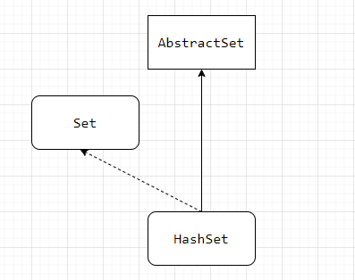

# HashSet




```java
public HashSet() {
    map = new HashMap<>();
}
```


```java
private static final Object PRESENT = new Object();

public boolean add(E e) {
    return map.put(e, PRESENT)==null;
}
```


## TreeSet


```java
public TreeSet() {
    this(new TreeMap<E,Object>());
}
```