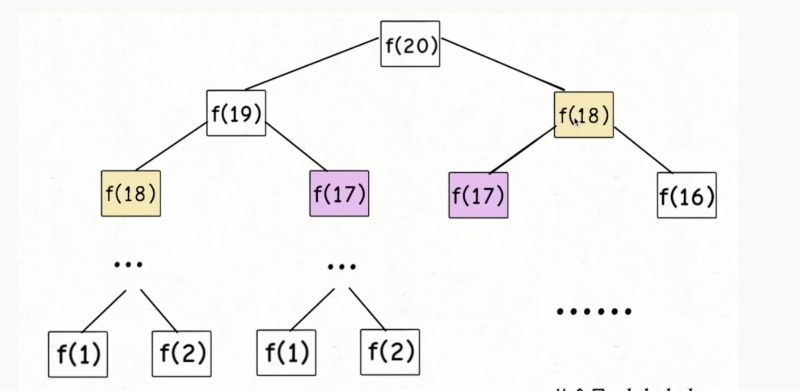
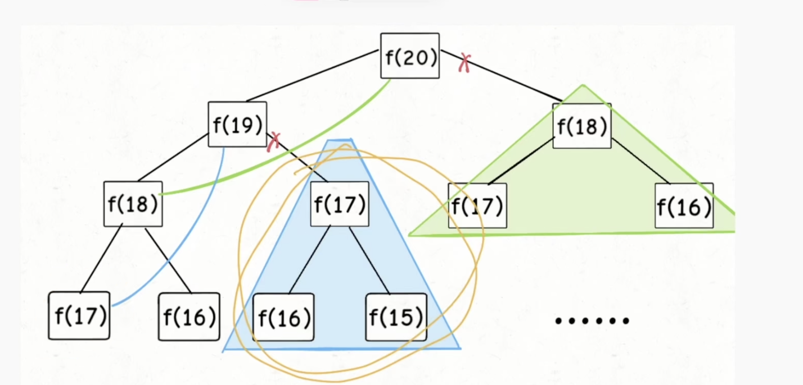
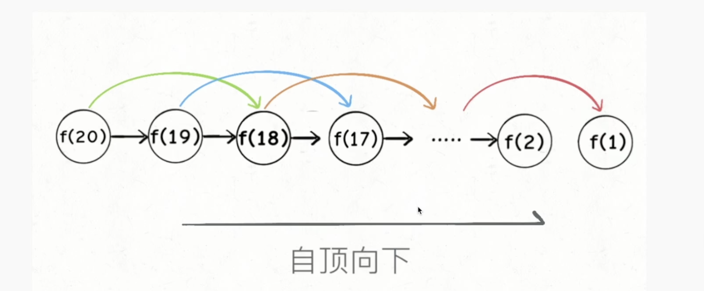
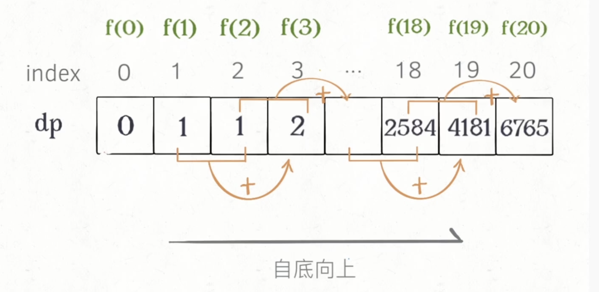

# 1.  二叉树遍历

二叉树定义模板

Python

```python
class TreeNode:
	def __init__(self, val):
		self.val = val
		self.left, rigth=None,None
```

Java

```java
public class TreeNode {
  public int val;
  public TreeNode left, right;
  public TreeNode(int val) {
    this.val = val;
    this.left = null;
    this.right = null;
  }
}
```


二叉树遍历模板

Python

```python
def preorder(self, root):
  if root:
    self.traverse_path.append(root.val)
    self.preorder(root.left)
    self.preorder(root.right)
def inorder(self, root):
  if root:
    self.inorder(root.left)
    self.traverse_path.append(root.val)
    self.inorder(root.right)
def postorder(self, root):
  if root:
    self.postorder(root.left)
    self.postorder(root.right)
    self.traverse_path.append(root.val)
```


Java

```java
public void preorder(root):
  if (root != null){
    this.traverse_path.append(root.val);
    preorder(root.left);
    preorder(root.right);
  }
public void inorder(root):
  if (root != null){
    inorder(root.left);
    this.traverse_path.append(root.val);
    inorder(root.right);
  }
public void postorder(root):
  if (root != null){
    postorder(root.left);
    postorder(root.right);
    this.traverse_path.append(root.val);
  }
```


# 2. 递归

盗梦空间：

- 向下进入到梦境中；向上又回到原来一层
- 通过声音同步回到上一层
- 每一层的环境和周围的人都是一份拷贝，主角等几个人穿越不同层级的梦境（发生和携带变化）


Python

```python
def recursion(level, param1, pamram2, ...):
  # recursion terminator: 终结条件
  if level > MAX_DEVEL:
    # process_result
    return
  
  # process logic in current level：当前层逻辑
  process(level, data...)
  
  # drill down：下探到下一层
  self.recursion(level + 1, p1, p2)
  
  # reverse the current level status if needed：清除当前层全局变量
```


Java

```java
public void recursion(level, param1, pamram2, ...):
  // recursion terminator: 终结条件
  if (level > MAX_DEVEL){
    // process_result
    return;
  }
  
  // process logic in current level：当前层逻辑
  process(level, data...);
  
  // drill down：下探到下一层
  recursion(level + 1, p1, p2);
  
  // reverse the current level status if needed：清除当前层全局变量
```


要点：

- 不要人肉递归（画状态树）
- 找到最近最简方法，将其拆解为可重复解决的问题（重复子问题）
- 数学归纳法

**递归函数的复杂度**=递归函数调用的次数 * 递归函数本身的复杂度


实战：爬楼梯和括号生成等问题

1. 假设你正在爬楼梯。需要 *n* 阶你才能到达楼顶。

每次你可以爬 1 或 2 个台阶。你有多少种不同的方法可以爬到楼顶呢

f(n)：爬到第 n 阶的方法总数

```
# 1: 1
# 2: 2
# 3: f(1) + f(2) 无重复子问题
# 4: f(2) + f(3)

# f(n) = f(n-1) + f(n-2)
```

f(n) = f(n-1) + f(n-2) 可以用动态规划进行优化


括号生成

2. 数字 n 代表生成括号的对数，请你设计一个函数，用于能够生成所有可能的并且 有效的 括号组合。

   ```
   示例 1：
   
   输入：n = 3
   输出：["((()))","(()())","(())()","()(())","()()()"]
   
   示例 2：
   输入：n = 1
   输出：["()"]
   ```


```java
public List<String> generateParenthesis(int n) {
	_generate(0, 2 * n, ""); // 第 0 层， 参数: 字符个数 2n, 初始字符串空串
  return null;
}
```


```java
public List<String> generateParenthesis(int n) {
	_generate(0, 2 * n, "");
  return null;
}

private void _generate(int level, int max, String s) {
  // recursion terminator: 
  if (level >= max){
    // process_result
    System.out.println(s);
    return;
  }
  // 每个位置要么左括号，要么右括号
  // process logic in current level：left, right
  String s1 = s + "(";
  String s2 = s + ")";
  
  // drill down：下探到下一层
  _generate(level + 1, max, s1);
  _generate(level + 1, max, s2);
}
```

上面的代码输出所有可能的字符串组合


```java
public List<String> generateParenthesis(int n) {
	_generate(0, 2 * n, "");
  return null;
}

private void _generate(int level, int max, String s) {
  // recursion terminator: 
  if (level >= max){
    // process_result
    // 可以在这里判断字符串是否合法
    System.out.println(s);
    return;
  }
  // 每个位置要么左括号，要么右括号
  // process logic in current level：left, right
  String s1 = s + "(";
  String s2 = s + ")";
  
  // drill down：下探到下一层
  _generate(level + 1, max, s1);
  _generate(level + 1, max, s2);
}
```


分析：

左括号 left 随时可以加，只要别超过 n 个

右括号 right 右个数 > 左个数

所以左括号和右括号都不超过 n 个，函数可改造为下方


```java
public List<String> generateParenthesis(int n) {
	_generate(0, 0, n, "");
  return null;
}

private void _generate(int left, int right, int n, String s) {
  // recursion terminator: 
  if (left == n && right == n){
    // process_result
    // 可以在这里判断字符串是否合法
    System.out.println(s);
    return;
  }
  // 每个位置要么左括号，要么右括号
  // process logic in current level：left, right
  if(left < n) {
  	_generate(left + 1, right, n, s + "(");
  }
  if(left > right) {
  	_generate(left, right + 1, n, s + ")");
  }
  // reverse status
}
```


# 3. 动态规划

动态规划可以从**上面的递归方程**中进行优化。

## 动态规划的特点

- 重叠子问题
- 状态转移方程
- 最优子结构

题型：求最值

核心：穷举

## 解题套路

1. 明确「状态」
2. 明确「选择」
3. 明确 dp 函数/数组的定义
4. 明确 base case （初始值，或者边界）

## 动态规划解法代码框架

```python
# 初始化 base case
d[0][0][..] = base
# 进行状态转移
for 状态1 in 状态1的所有值：
	for 状态2 in 状态2的所有值：
  	for ...:
      d[状态1][状态2][..] = 求最值(选择1，选择 2...)
```


### 斐波那契数列

暴力解法

```java
public int fib(int n) {
  // base case
  if(n == 0 || n == 1) {
    return n;
  }
  // 状态转移
	return fib(n-1) + fib(n-2);
}
```





暴力递归存在重复计算，需要一个带备忘录的递归算法


```java
public int fib(int n) {
  int[] memo = new int[n+1];
	return helper(n, memo);
}

public int helper(int n, int[] memo) {
  // base case
	if(n == 0 || n == 1) return n;
  if(memo[n] != 0) return meno[n];
  // 状态转移
  memo[n] = helper(n-1, memo) + helper(n-2, memo);
  return memo[n];
}

```





上述是一个自顶向下的算法，可根据状态转移方程转为自底向上的解法



数组的迭代算法

```java
public int fib(int n) {
  // base case
  if(n == 0) return n; 
  int[] memo = new int[n+1];
  meno[0] = 0, memo[1] = 1;
  for(int i = 2; i <= n; i++) {
    // 状态转移
    meno[i] = memo[i-1]+memo[i-2];
  }
  return memo[n];
}
```




空间复杂度还可以优化为 O(1)

```java
public int fib(int n) {
  // base case
  if(n == 0 || n == 1) return n;
  int pre = 0, next = 1;
  for(int i = 2; i <= n; i++) {
    // 状态转移
    int sum = pre + next;
    pre = next;
    next = sum;
  }
  return memo[n];
}
```


[最长公共子序列](https://leetcode-cn.com/problems/longest-common-subsequence/)

给定两个字符串 text1 和 text2，返回这两个字符串的最长 公共子序列 的长度。如果不存在 公共子序列 ，返回 0 。

一个字符串的 子序列 是指这样一个新的字符串：它是由原字符串在不改变字符的相对顺序的情况下删除某些字符（也可以不删除任何字符）后组成的新字符串。

例如，"ace" 是 "abcde" 的子序列，但 "aec" 不是 "abcde" 的子序列。
两个字符串的 公共子序列 是这两个字符串所共同拥有的子序列。


```
示例 1：

输入：text1 = "abcde", text2 = "ace" 
输出：3  
解释：最长公共子序列是 "ace" ，它的长度为 3 。

示例 2：

输入：text1 = "abc", text2 = "abc"
输出：3
解释：最长公共子序列是 "abc" ，它的长度为 3 。
```


最长公共子序列问题是典型的二维动态规划问题。

