### 数据库字典修改

ldAdv 为业务名，也是页面前缀名字

```sql
SELECT * FROM BUP_DDM_BIZ bdb WHERE eng_name = 'ldAdv' ;
SELECT * FROM BUP_DDM_BIZ_MODULE bdbm WHERE id='MOD0e21168da57a20168da7bb50e0019'; 0	TFB_GREX_ADV TFB_GREX_ML
SELECT * FROM BUP_DDM_BIZ_SPCS bdbs WHERE id='SYS0e21168da57a20168da7bb50e0010';
```

查出 table_name 为 TFB_GREX_ADV

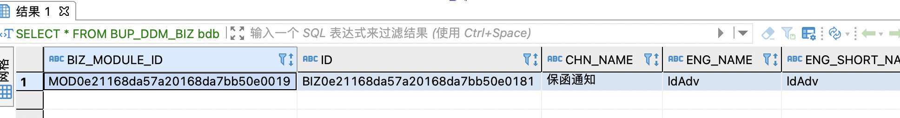


查出 table_name 为 TFB_GREX_ML

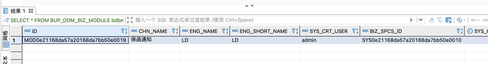


拿字段名去

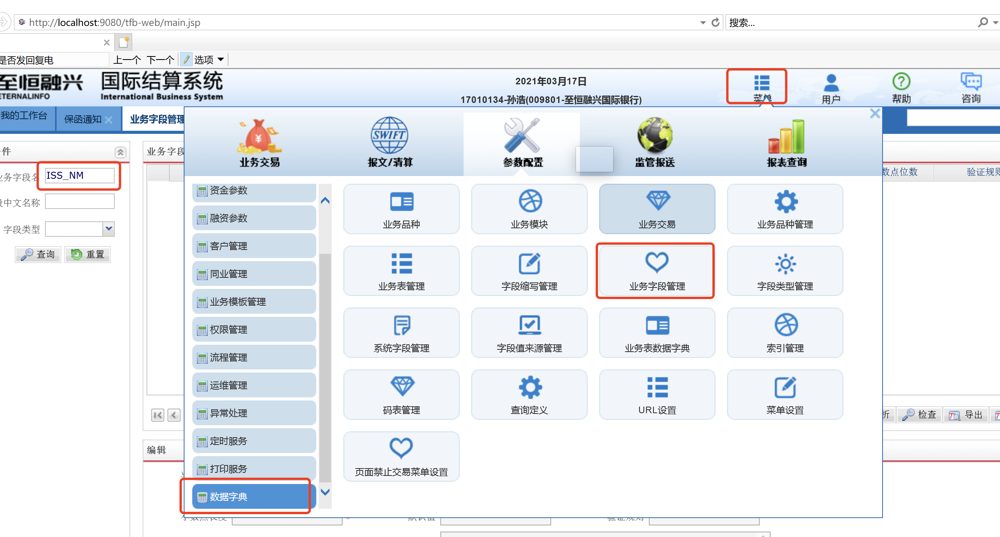

若是字段不存在则新增

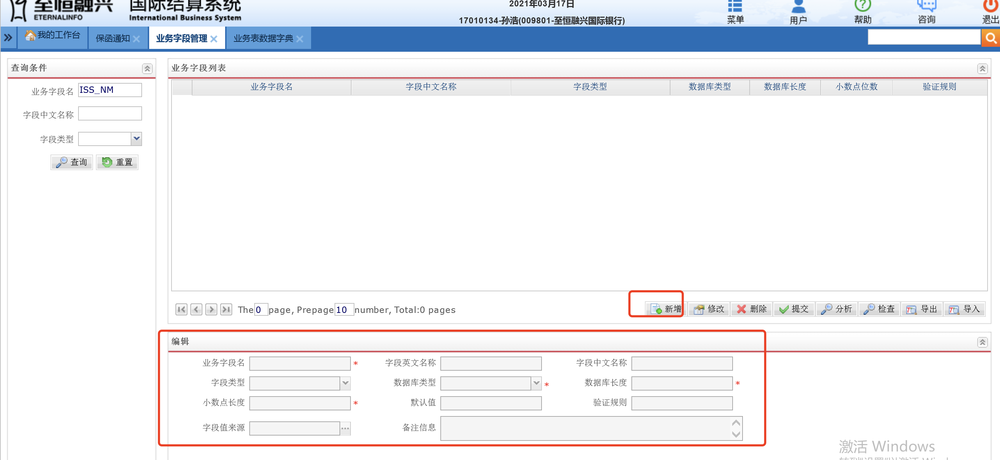


然后在 

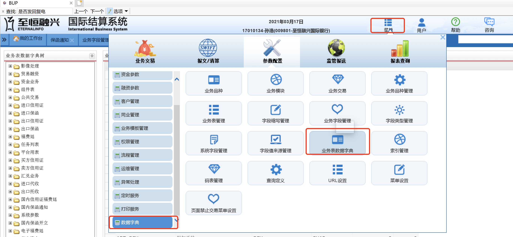


在左边找到对应的业务,   选择一个表 TFB_GREX_ML， 并点击修改按钮

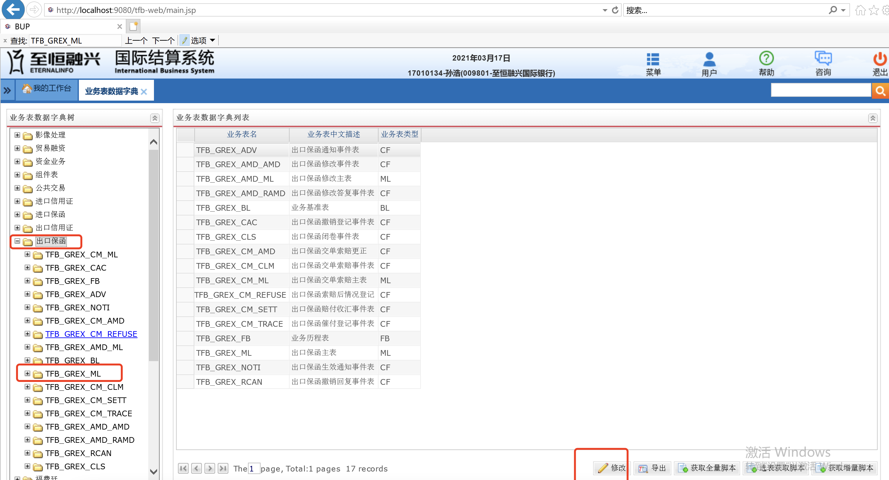


弹出窗口，将你新增的字段查询下, 点击 OK 进行提交

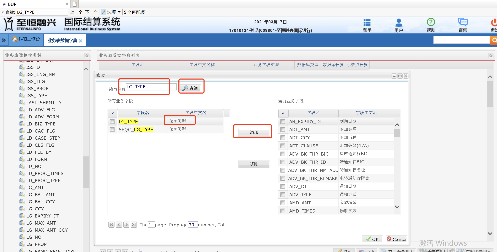


业务主表也要加上字段

比如业务主表 TFB_GREX_ML


### 增加前端下拉框


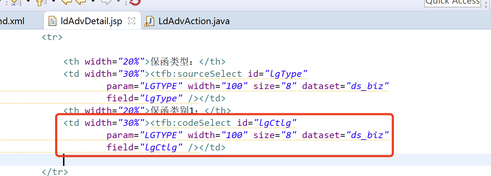


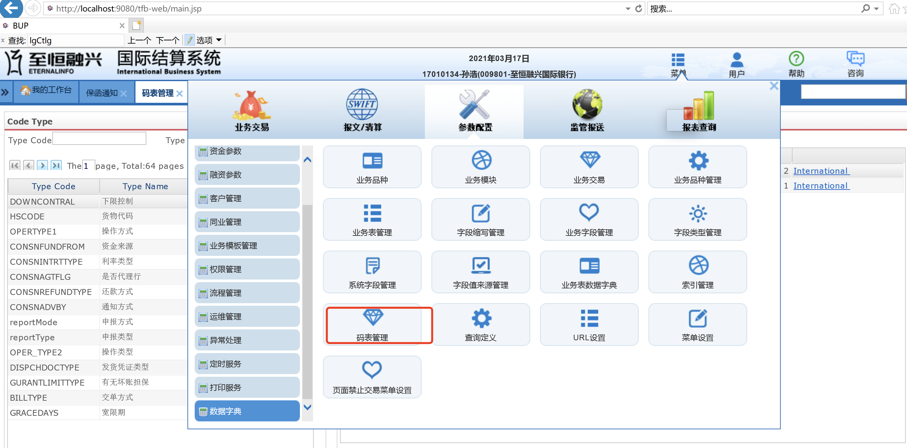


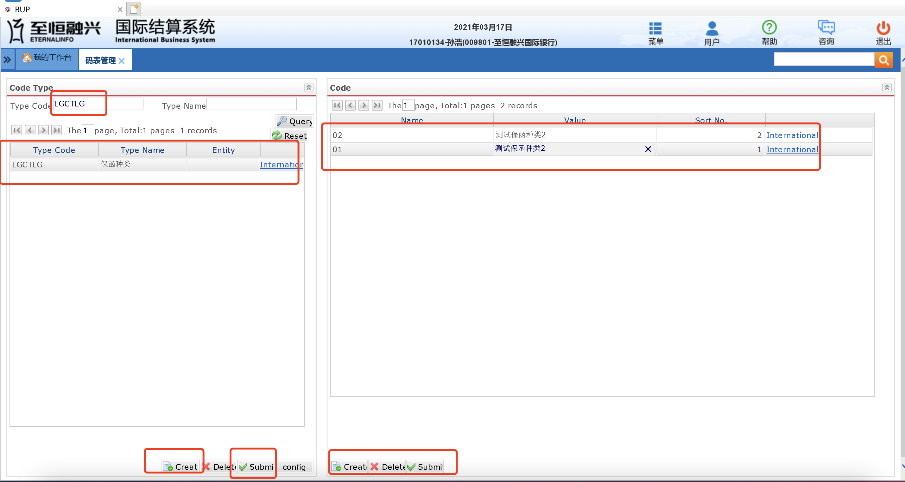

数据库结构

```sql
select * from ip_code_info  where code_type = 'LGCTLG';
```

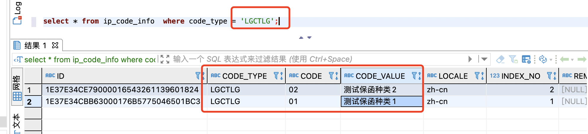


提交成功后：

主表

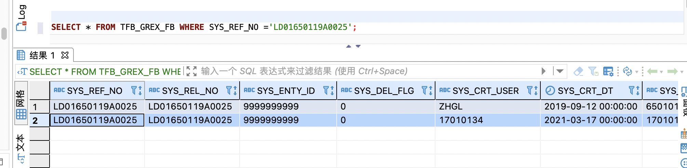


### 复核

总行或者上级银行才有复核权限，支行没有审核上级银行经办的权限

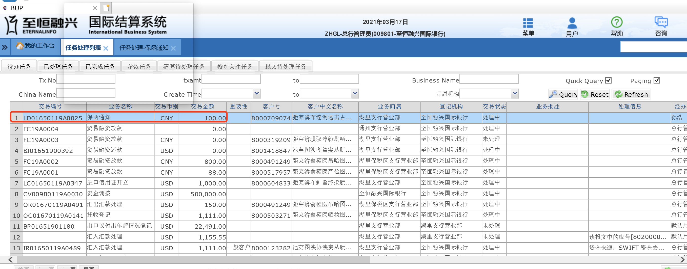


### ldAdv_swift.xml

业务（bizCode）_swift.xml

```xml
<configItem desc="通知确认报文" ext1="768" ext2="3" name="768">
    <defaultVal>
     <map>
      <entry key="tag20" value=""/>
      <entry key="tag21" value=""/>
      <entry key="refNo" value=""/>
      <entry key="tag25" value=""/>
      <entry key="tag30" value=""/>
      <entry key="tag71B" value=""/>
      <entry key="tag72" value=""/>
     </map>
    </defaultVal>
    <configItem desc="choice" ext1="SubVO" name="tag32">
     <defaultVal>
      <map>
       <entry key="option" value=""/>
       <entry key="date" value=""/>
       <entry key="currency" value=""/>
       <entry key="amount" value=""/>
      </map>
     </defaultVal>
    </configItem>
    <configItem desc="choice" ext1="SubVO" name="tag57">
     <defaultVal>
      <map>
       <entry key="option" value=""/>
       <entry key="dcFlag" value=""/>
       <entry key="bankCode" value=""/>
       <entry key="bankAcct" value=""/>
       <entry key="location" value=""/>
       <entry key="nameAddress" value=""/>
      </map>
     </defaultVal>
    </configItem>
     </configItem>
```


### Bean2Msg.xml

报文发送




### Msg2Bean.xml

报文接收


### 报文出错

将以下代码注释掉即可。

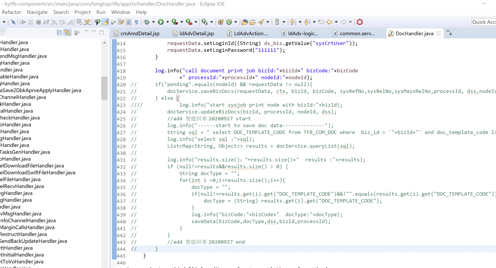


### 其他问题

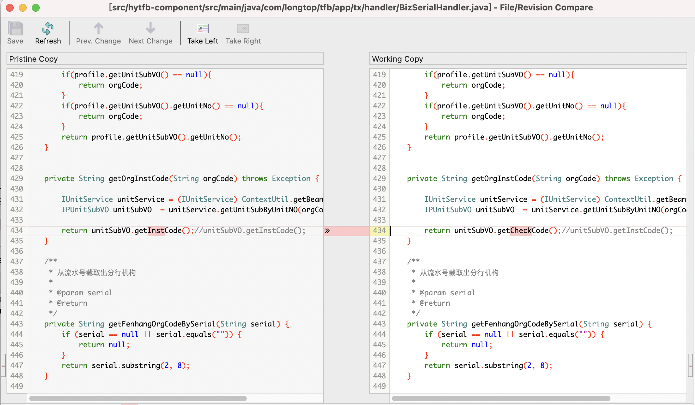


ldAdvDetail.js

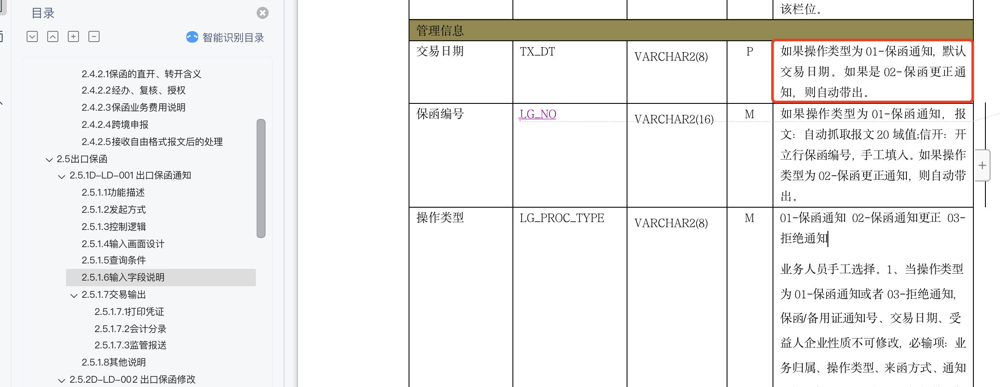

```
function _GEN_ds_biz_onAfterChange(dataset,record,field) {
   if(field.name == "lgCcy") {
			var cmd = $.cmd("logic_biz_command");
			cmd.setMethod("setLgCcy");//
			cmd.execute();
			_GEN__ds_biz_lgCcy_CHANGE();			
	   }
}
```

