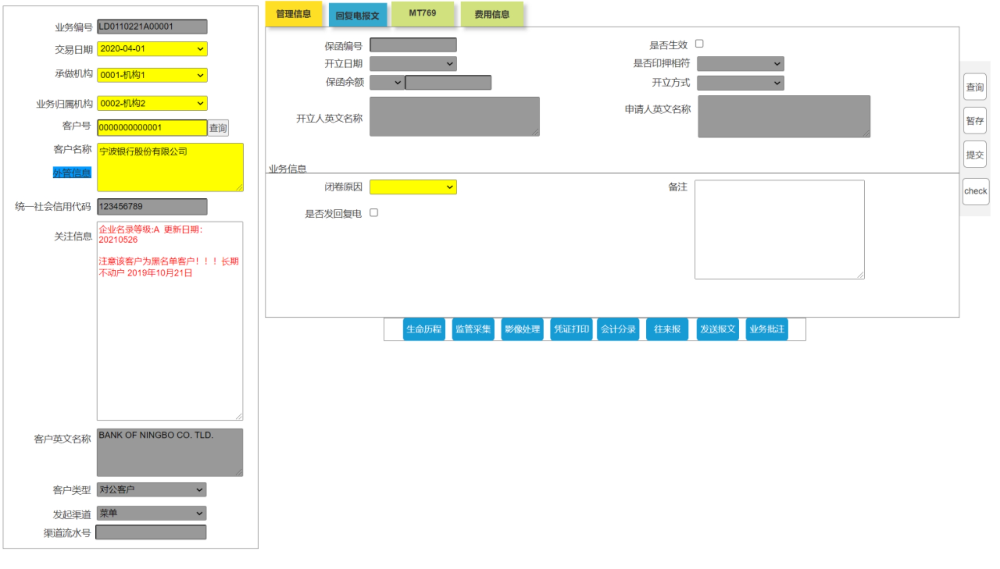

ldClsDetail.jsp




```：
保函编号：lgNo
是否生效：effctFlg
开立日期：issDt
是否印押相符：rlsType
保函余额：lgBalAmt
开立方式：issFlg
开立人英文名：issEngNm
申请人英文名称：gurantEngNm
闭卷原因：clsCause
是否发回复电：sendSwfFlg
备注：remark

我行BIC: ownrBkBic
收报行BIC: recvBkBic
我行编号: ownerBkRefNo
收报行编号: recvBkRefNo
收费主动借记账号: debitFeeAcc
减额/解除日期(30): clsTxDt
我行费用币种(32a)：ourFeeCcy
我行费用金额：ourFeeAmt
闭卷说明: rlsClsReason
账户行BIC：accBkBic
我行在账户行开户账号：accBkAcc
费用描述：advFeeDesc
附言：clsSwf72
单据处置: sendBy

报文类型：swfType
我行BIC：rlsOwnrBkBic
我行编号:rlsOwnrBkRefNo
收报行BIC： rlsRecvBkBic
收报行编号: rlsRecvBkRefNo
报文内容: swiftRemark

```


