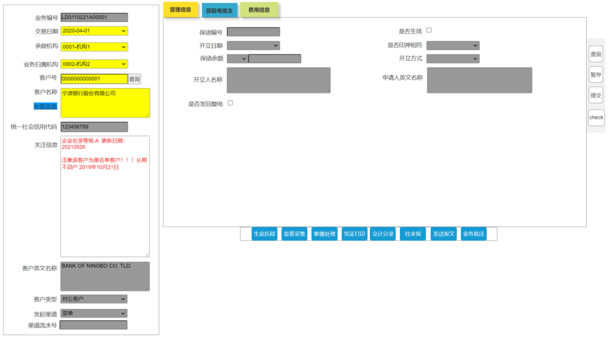
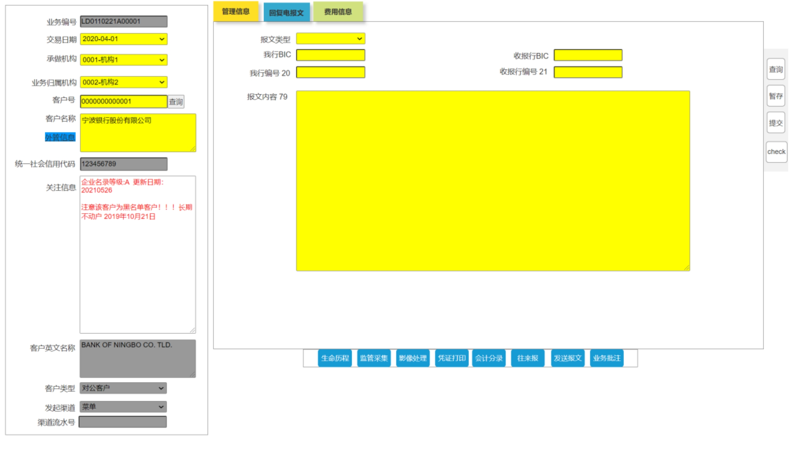

```
http://localhost:9080/tfb-web/jsp/app/expt/ld/ldCacDetail.jsp?serviceName=ldCac.init
```

入项、单选项、复选项、自动（即根据已输入数据自动生成）等。）

| ***\*字段\*******\*中文\*******\*名称\**** | ***\*字段名称\**** | ***\*字段\*******\*类型\**** | ***\*是否必输\**** | ***\*备注\****                                           |
| ------------------------------------------ | ------------------ | ---------------------------- | ------------------ | -------------------------------------------------------- |
| 保函/备用证通知号                          | LD_NO              | WARCHAR2(32)                 | H                  | 根据查询结果带出                                         |
| 业务所属                                   | BIZ_BR_CDE         | VARCHAR2(16)                 | H                  | 根据查询结果带出                                         |
| 受益人ID                                   | BEN_ID             | VARCHAR2(32)                 | H                  | 根据查询结果带出                                         |
| 受益人英文名称                             | BEN_ENG_NM         | VARCHAR2(140)                | H                  | 根据查询结果带出                                         |
| 受益人中文名称                             | BEN_NM_CN          | VARCHAR2(140)                | H                  | 根据查询结果带出                                         |
| 管理信息                                   |                    |                              |                    |                                                          |
| 保函编号                                   | LG_NO              | VARCHAR2(16)                 | P                  | 根据查询结果带出                                         |
| 开立日期                                   | ISS_DT             | VARCHAR2(8)                  | P                  | 根据查询结果带出                                         |
| 保函币种                                   | LG_CCY             | CHAR(3)                      | P                  | 根据查询结果带出                                         |
| 保函余额                                   | LG_BAL             | NUMBER(18,2)                 | P                  | 根据查询结果带出                                         |
| 是否生效                                   | EFFCT_FLG          | CHAR(1)                      | P                  | 根据查询结果带出                                         |
| 是否印押相符                               | RLS_TYPE           | VARCHAR2(8)                  | P                  | 根据查询结果带出                                         |
| 开立人名称                                 | ISS_ENG_NM         | VARCHAR2(140)                | P                  | 根据查询结果带出                                         |
| 申请人英文名称                             | GURANT_ENG_NM      | VARCHAR2(140)                | P                  | 根据查询结果带出                                         |
| 是否发回复电                               | SEND_FLG           | CHAR(1)                      | O                  | 勾选框，0-否，1-是，默认否.勾选时显示回复电文TAB页       |
| 回复电文TAB页--“是否发回复电”勾选时显示    |                    |                              |                    |                                                          |
| 报文类型                                   | ACK_SWF_TYPE       | VARCHAR2(8)                  | O                  | “是否发回复电”勾选时必输，其他选输下拉选择：MT799  MT999 |
| 我行BIC                                    | OWNR_BK_BIC        | VARCHAR2(16)                 | O                  | “是否发回复电”勾选时必输，其他选输                       |
| 接收行BIC                                  | RECV_BK_BIC        | VARCHAR2(16)                 | O                  | “是否发回复电”勾选时必输，其他选输                       |
| 我行编号（20）                             | OWNER_BK_REF_NO    | VARCHAR2(16)                 | O                  | “是否发回复电”勾选时必输，其他选输                       |
| 收报行编号（21）                           | RECV_BK_REF_NO     | VARCHAR2(16)                 | O                  | “是否发回复电”勾选时必输，其他选输                       |
| 发报内容（79）                             | SWIFT_REMARK       | VARCHAR2(2048)               | O                  | “是否发回复电”勾选时必输，其他选输                       |




```
保函编号：lgNo
是否生效：effctFlg
开立日期：issDt
是否印押相符：rlsType
保函余额：lgBalAmt
开立方式：issFlg
开立人英文名称：issEngNm
申请人英文名称：gurantEngNm
是否发回复电：sendFlg

报文类型: ackSwfType
我行BIC：ownrBkBic
收报行BIC：recvBkBic
我行编号：ownerBkRefNo
收报行编号：recvBkRefNo
报文内容：swiftRemark
```




```
报文类型：
```


