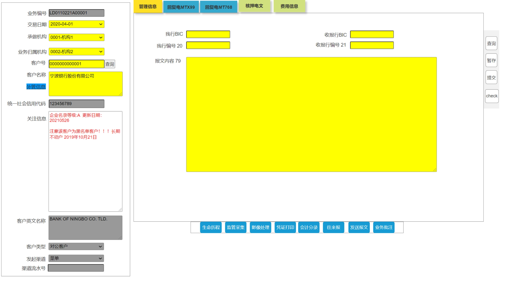

### 前端页面

前端页面下拉框值设置：

```sql
select * from ip_code_info  where code_type like '%BPFUNDFROM%';
```


### 页面

http://localhost:9080/tfb-web/jsp/app/expt/ld/ldAdvDetail.jsp

### 数据库表字段

*现有字段*/新字段对比

=================

| 保函号码：LG_NO                          | S                                   | 来函方式：*LD_ADV_FORM*       | S              |
| ---------------------------------------- | ----------------------------------- | ----------------------------- | -------------- |
| 是否印押相符：RLS_TYPE                   | S                                   | 核押方式：RLS_FORM            | S              |
| 通知日期：ADV_DT                         | S                                   | 操作类型：LD_PROC_TYPE        | S              |
| 开立日期：ISS_DT                         | S                                   | 开立方式：ISS_FLG             | S              |
| 是否融资性保函：PUR_FLG(押汇标识)        | X                                   | 是否允许转运：*TRM_SHPMT_FLG* | X              |
| 开立人BIC：                              | S                                   | 开立人英文名称：ISS_ENG_NM    | X              |
| 受益人英文名称：                         | X                                   | 受益人中文名称：              | X              |
| 受益人企业性质：                         | X                                   | 开立人性质                    | S              |
| 被担保人英文名称：                       | X                                   | 被担保人国别：                | X              |
| 保函金额：                               | S                                   | 附加金额：                    | X              |
| 保函最大金额：                           | X                                   | 预通知：                      | X              |
| 到期日：                                 | S                                   | 到期事件：                    | S              |
| 可转让标志：                             | X                                   | 可撤销标志：                  | X              |
| 金额浮动百分比：                         | X                                   | 备注信息:  *REMARK_INFO*      | X              |
|                                          |                                     |                               |                |
|                                          |                                     |                               |                |
| 通知方式：ADV_TYPE                       | X                                   | 转递方式：*TRM_TYPE*          | X              |
| 转通知行名址：ADV_BK_THR_NM_ADDR         | X                                   |                               |                |
| 转通知行BIC：ADV_BK_THR_ID               | X                                   |                               |                |
| 保函形式：*LD_FORM*                      |                                     |                               |                |
| 电转通知附言：*ADV_BK_THR_REMARK*        |                                     | 费用承担方：*LD_FEE_BY*       | X              |
| 是否发回复电：SEND_FLG(是FALSE发回复电)  | S                                   |                               |                |
| 是否代理行：                             | X                                   |                               |                |
| 快递单号：                               | X                                   | 快递公司：                    | X              |
|                                          |                                     |                               |                |
| 适用规则：                               | X                                   | 有效地：                      | X              |
| 偿付行名址：                             | X                                   | 申请人名址：                  | X              |
| 转递（让）编号：                         | X                                   | 转递（让）行名址：            | X              |
| 即远期标识：                             | X                                   | 远期天数：                    | X              |
| 汇票付款人名址：                         | X                                   | 交单期：                      | X              |
| 起运地：                                 | X                                   | 最终目的地：                  | X              |
| 最迟装运期：                             | X                                   | 航运时限：                    | X              |
| 起运港：                                 | X                                   | 卸货港：                      | X              |
| 货物/劳务描述：                          | X                                   | 是否允许分批装运：            | X              |
| 混合付款条款：                           | X                                   | 延期付款条款：                | X              |
| 单据要求：                               | X                                   | 附加条款：                    | X              |
| 给付款行,承兑行或议付行的指示(78)：      | X                                   | 给收报人的信息(72)：          | X              |
|                                          |                                     |                               |                |
|                                          |                                     |                               |                |
|                                          | =======新的字段========             |                               |                |
|                                          |                                     |                               |                |
| 开立人名称：ISS_ENG_NM（开立人英文名称） | V(ISS_NM)                           | 申请人英文名称：CST_ENG_NM    | S              |
| 开立人性质:ISS_PROP                      | S                                   | 申请人国别                    | V(CST_CNT_CDE) |
| 是否生效                                 | V                                   | 保函类别:                     | V(LG_CTLG)     |
| 备注: REMARK                             | S                                   | 保函类型                      | V(LG_TYPE)     |
|                                          |                                     | 报文类型: SWF_TYPE            | S              |
|                                          |                                     |                               |                |
|                                          |                                     |                               |                |
|                                          |                                     |                               |                |
| 我行BIC: OWNR_BK_BIC                     | S                                   | 收报行BIC: RECV_BK_BIC        | S              |
| 我行编号: OWNR_BK_REF_NO                 | S                                   | 收报行编号: RECV_BK_REF_NO    | S              |
| 报文内容:                                | ?RECVR_CRR_INFO(给收报人的信息(72)) |                               |                |
|                                          |                                     |                               |                |
| 收费主动借记账号                         | V                                   | 通知日期：ADV_DT              | S              |
| 账户行BIC                                | V                                   | 我行在开户行开户账号          | V              |
| 费用描述                                 | V                                   | 附言                          | V              |
| 单据处置                                 | V                                   |                               |                |
|                                          |                                     |                               |                |
|                                          |                                     |                               |                |
|                                          |                                     |                               |                |


=================


管理信息：

保函编号：*lgNo* 

是否生效：effctFlg

操作类型：*ldProcType*

通知日期：*advDt*

开立日期：*issDt*

是否印押相符：*rlsType*

开立方式: *issFlg*

核押方式： *~~rlsForm~~*

来函方式：ldAdvForm

保函类型：*lgType*。保函类别 LD_FORM

开立人BIC：*issBkBic*

保函类别：lgCtlg

开立人名称：*issEngNm*

申请人英文名称：*gurantEngNm*

开立人性质：*issProp*

申请人国别：*gurantCntCde*

保函金额：*lgAmt*

是否发回复电：*sendFlg*

到期日期：expiryDt

报文类型：*ackSwfType *:  新增字段和字典值

到期事件：V

备注：remark

==========





我行BIC: *ownrBkBic*

收报行BIC：*recvBkBic*

我行编号：ownerBkRefNo

收报行编号：recvBkRefNo

报文内容：swiftRemark


收费主动借记账号: debitFeeAcc

通知日期：V

账户行BIC：ACC_BK_BIC。 accBkBic

我行在账户行开户账号：ACC_BK_ACC  accBkAcc

费用描述 71D：ADV_FEE_DESC *advFeeDesc*

附言：ADV_SWF_72 ???

单据处置：*SEND_BY*  *sendBy*


报文类型:  *RLS_SWF_TYPE*?????????   *rlsSwfType*

我行BIC: RLS_OWNR_BK_BIC. *rlsBkBic*

收报行BIC: RLS_RECV_BK_BIC **rlsRecvBkBic**

我行编号: RLS_OWNER_BK_REF_NO *rlsOwnerBkRefNo*

收报行编号: RLS_RECV_BK_REF_NO *rlsRecvBkRefNo*

报文内容: *RLS_REMARK*  *rlsRemark*


