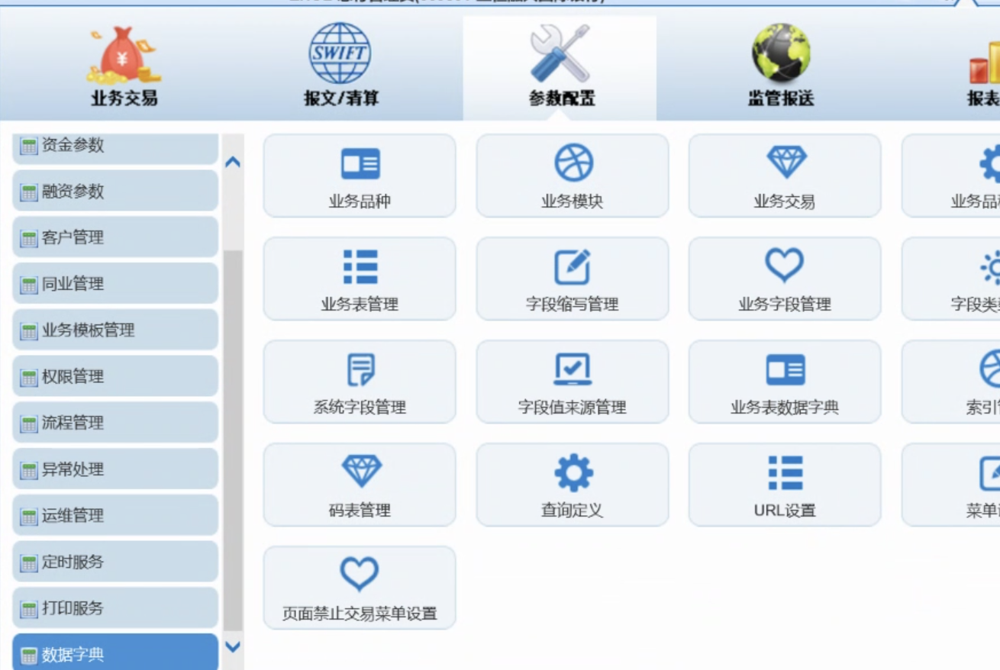
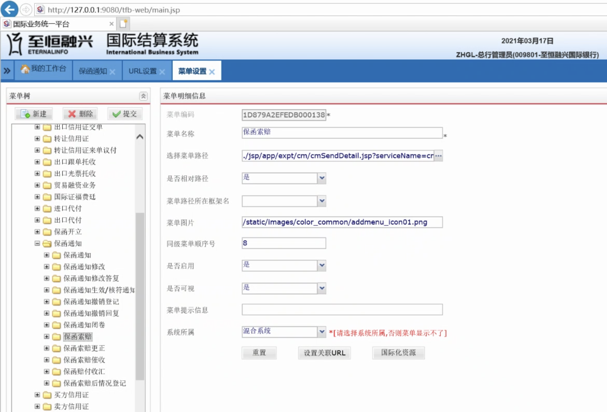

  数据库：172.16.97.188:1521:orcl   用户/密码：devlgtfb/devlgtfb

  原来的数据字典基本够用，附件数据字典有增加栏位标橙色的部分你增加一下，标删除线的先不删除我还在整理。


Hyhup -lg-web


数据字典手动加







ldAdvDetail.jsp

```
		<!--  电子保函升级改造 -->
		<tfb:field name="lgType" label="保函类型" dataType="string"/>
		<tfb:field name="lgCtlg" label="保函种类" dataType="string"/>
```


```
										<tr>
										    <th width="20%">保函类别：</th>
											<td width="30%"><tfb:codeSelect id="lgCtlg"
													param="LGCTLG" width="100" size="8" dataset="ds_biz"
													field="lgCtlg" /></td>
											<th width="20%">保函类型：</th>
											<td width="30%"><tfb:sourceSelect id="lgType"
													param="LGTYPE" width="100" size="8" dataset="ds_biz"
													field="lgType" /></td>
										</tr>
										<tr>
```


```
		// 电子保函升级 
		ds_biz.getField("lgCtlg").setRequired(true);// 保函类别
		ds_biz.getField("lgType").setRequired(true);// 保函类型
```

